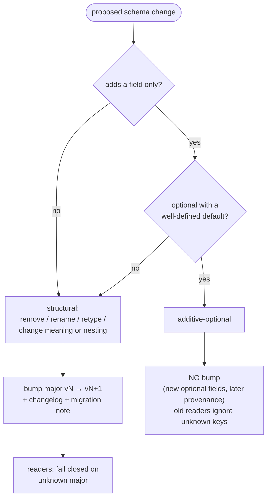

# Trace/Result Schema & Migration Policy

RAMPART serializes every safety `Result` through a single canonical, versioned
schema (`rampart.core.serialization`). The same schema backs xdist transport,
failure attachments, reporting projections, and — in future work — replay and
golden traces. This page is the written, reviewed migration policy that gates
any durable trace artifact.

## Versioning

- Every serialized record carries one root `version` field. The current schema
  is **`rampart.trace.v1`**.
- The record version is **independent** of the xdist transport envelope version
  (`rampart.xdist.v2`). The two axes move separately; an `xdist.v2` envelope may
  carry a `trace.v1` record.
- There is a **single root version** — nested types (`Turn`, `Payload`,
  `EvalResult`, …) do not carry their own versions.

## What is and is not a breaking change

- **Additive-optional = no bump.** A new optional field that older readers may
  ignore, and whose absence has a defined default, does not change the major.
- **Missing = not recorded (not "false").** An absent optional field means the
  producer *did not record it* — never that its value was empty, false, or zero.
  Readers supply a default for *shape* only; consumers must not infer a semantic
  negative from absence. A v1 record with no `manifest_snapshot` means "the
  manifest was not captured," not "there was no manifest."
- **Structural change = major bump.** Removing, renaming, or retyping a field,
  or changing its meaning or nesting, bumps `vN → vN+1` with a changelog and a
  migration note.

## Reader posture

- Readers tolerate unknown fields and **fail closed on an unknown major** — a
  record is never best-effort parsed across a major boundary.
- Forward compatibility is **additive-only within a major**. A newer major read
  by an older framework fails closed by design.
- Any derived JSON Schema is therefore **open** (`additionalProperties: true`).

## Enum posture

- The closed enums — `SafetyStatus`, `EvalOutcome`, `ObservabilityLevel`, and
  `PayloadFormat` — **fail closed** on an unknown value. A durable safety
  artifact must never silently misread one; there is no warn-and-degrade path.
- `HarmCategory` is the sole exception: it travels as a **passthrough string**
  and is never coerced, so a new harm label from a future producer round-trips
  unchanged on an older reader.

## Binary / opaque payloads

- A non-text payload persists as a content-addressed
  `{sha256, media_type, bundle_path}` descriptor in `artifacts[]`, never inline.
- A decoder that meets a binary reference with **no artifact resolver wired
  fails closed** — it never coerces the payload to `PayloadFormat.TEXT`.
- The descriptor shape is frozen now (populating `artifacts[]` later is
  additive-optional); the resolver and companion bundles are built by the replay
  work, not by this gate. At `rampart.trace.v1` there is no resolver, so binary
  payloads fail closed on both encode and decode.

## Migration mechanics

- Each major bump ships an **adjacent upcaster** (`vN-1 → vN`) plus an explicit
  **migration API/CLI**.
- Writers always emit the **latest** major.
- Reads **never rewrite** persisted files in place. Backward-*reading* an old
  major is not the same as migrating an artifact — migration is an explicit,
  opt-in step, never a silent rewrite.

## Reserved additive fields (named now, populated later)

To make the additive path concrete, these slots are reserved by name so future
work drops in without a bump, as **record-level wire-only collar slots**:
`manifest_snapshot`, `evaluation_fingerprint`, `replay_provenance`,
`population_ref`, plus `artifacts` / `target` / `provenance`. A field that is
truly *intrinsic to a result* instead lands as an additive-optional field on
`Result`, inside the referenced `result` body. Either way each is
additive-optional; none is populated at v1.

Later trigger-/persistence-phase provenance fields are additive-optional and
**must not** force a hard migration or major bump.

## Support window

After the **first durable-trace release** (the first release that writes
persisted golden traces/evidence, on by default), RAMPART supports reading `vN`
and `vN-1` for **two subsequent framework releases** (one deprecation cycle),
keyed on **release, not time**, with a changelog and migration note on any bump.
Before that release there is no durable-read obligation.

## Ship gate

Ship **no durable artifact — golden traces above all — until the schema has a
per-result `version` field and this policy is in effect.**

