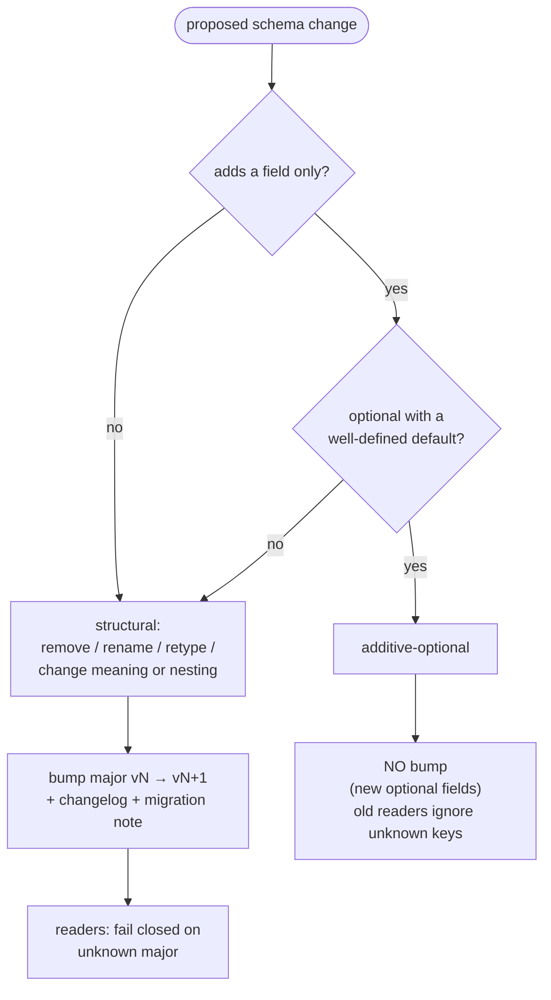

# Trace/Result Schema & Migration Policy

`rampart.core.serialization` defines RAMPART's canonical, versioned
`Result`-record format. `ResultRecord` references a result and optional
`pytest_nodeid` / `result_index` attribution.
`serialize_record(record=...)` converts a `ResultRecord` to JSON text (`str`);
`deserialize_record(data=...)` reconstructs a `ResultRecord` from JSON text.
Existing xdist and reporting consumers are not yet wired to this module.

This page defines how the schema may evolve as consumers adopt it.

## Serialization and schema generation

`serialize_record()` and `deserialize_record()` are the only public conversion
API. The serialization module owns both the versioned envelope and its body,
using one cached Pydantic `TypeAdapter` over the existing standard dataclasses.
Neither `Result` nor `ResultRecord` exposes dictionary-conversion methods.
`ResultRecord` references the live result; serialization does not mutate it.

```python
import json

from rampart.core.serialization import (
    ResultRecord,
    deserialize_record,
    serialize_record,
)

record = ResultRecord(result=result, pytest_nodeid="tests/test_safety.py::test_case")
text = serialize_record(record=record)
restored = deserialize_record(data=text)
canonical = json.loads(text)
```

Projections and structured transports obtain dictionaries by parsing the
canonical JSON, not by maintaining another result serializer or importing private
helpers. Transports that already hold a record dictionary can use
`deserialize_record(data=json.dumps(canonical, allow_nan=False))`.
The nested `result` body is unversioned and must not be persisted on its own.

Malformed JSON and invalid record values raise `SchemaError`; unsupported
versions raise its `UnsupportedSchemaVersionError` subclass.

The adapter validates nested fields without string, boolean, or integer
coercion. The parsed body is checked for JSON-only values before strict
JSON-mode validation reconstructs the dataclasses. Missing fields use their
declared defaults; explicit `null` is accepted only on nullable fields. Payload
IDs must be recorded, not generated during deserialization. These boundary
rules do not replace the normal dataclass constructors used during execution.

Body encoding uses adapter-local enum and datetime serializers in Python mode,
then validates the body through the same reader logic before emitting record JSON.
This extra validation pass aligns writer and reader nesting support without
introducing a new depth cap or inheriting Pydantic's lower JSON-mode writer limit.
Interpreter and parser recursion limits still apply; failures raise `SchemaError`.

These policies belong to the cached canonical adapter, not to the public
dataclass annotations or configuration. Fields remain `dict[str, Any]` and
`datetime | None`. Independently constructed Pydantic adapters retain their
normal behavior, including live binary payload support.
The canonical adapter supplies its own `datetime` / `Path` resolution namespace;
the shared types module keeps those imports under `TYPE_CHECKING`.

`ResultRecord.json_schema()` returns the adapter-derived body schema plus the
versioned envelope. Small schema customizations describe the trace-only payload
restrictions and the request invariant (a prompt or at least one attachment).
`JsonSchemaValue` is the return type, not a separate model or validator.
The open Draft 2020-12 contract is committed at `schemas/trace.v1.schema.json`.

Regenerate it with `uv run python scripts/generate_trace_schema.py`.
The generator selects the filename from `TRACE_SCHEMA_VERSION`. CI runs the same
command with `--check` to detect drift.

### Required compatibility decision

Schema drift checking alone does not establish compatibility. A separate CI gate
requires a checked-in decision in `schemas/trace-compatibility.json`, bound to the
contract content by SHA-256 fingerprints. The inputs are `result.py`, `types.py`,
`serialization.py`, `_schema.py`, and all published `trace.v*.schema.json` files.
Watching the models and codec policies also catches changes that do not appear
in JSON Schema. This is deliberately conservative: even a nonsemantic edit to
these inputs needs a compatibility rationale.

For a contract change, update the declaration:

- **`initial`** introduces the first contract where the PR base has no trace schema.
- **`compatible`** retains the current major and explains why the change preserves
  compatibility, such as an additive-optional field with a defined absence behavior.
- **`new-major`** increments the major by one, retains earlier published schema
  files, and references a nonempty repository migration document in `migration_note`.
  The migration obligations below still apply, including an upcaster and API/CLI.

The declaration records the current `version`, `contract_sha256`,
`previous_contract_sha256`, `decision`, and `rationale`. For a change to an existing
contract, the previous fingerprint must match the PR base's declaration. Obtain
the current fingerprint after regenerating the schema:

```text
uv run python scripts/check_trace_compatibility.py --fingerprint
uv run python scripts/check_trace_compatibility.py --base-ref <PR-base-commit>
```

PR CI compares against the actual target base commit; a stale declaration fails
even if the schema was regenerated. Unchanged contracts need no new decision.
Without `--base-ref`, including on main-branch pushes, the command checks the
declaration's version and current content fingerprint only.

**The declaration is a review gate, not proof of compatibility.** Reviewers must
assess the rationale, semantic behavior, and required migration implementation.
A regenerated schema or a `compatible` assertion does not make a breaking change
safe. Keep the input list current if contract policy moves to additional modules.

### Structural schema and decoder semantics

The JSON Schema checks structure; passing it is necessary but **not sufficient**
for successful record decoding. Use `deserialize_record()` for the complete
contract.

The decoder additionally enforces these representation rules:

- Integer fields use integer notation, not floating-point notation. JSON Schema
  accepts `0.0` as an integer mathematically; the strict decoder rejects it for
  fields such as `result_index`, `turn_number`, and population `index` / `size`.
- Timestamp strings must parse with Python's `datetime.fromisoformat()`. The
  schema intentionally does not claim RFC 3339 validation, since Python supports
  naive datetimes and subminute UTC offsets.
- Numbers must be finite and representable by the corresponding Python field.
  For example, an overflowing JSON exponent cannot become an infinite float.
- Strings and mapping keys must contain Unicode scalar values. Surrogate code
  points in Python strings are rejected, not replaced or combined. Valid JSON
  surrogate-pair escapes for characters such as emoji remain supported.

External producers should emit integer notation for integer fields, supported
ISO datetime strings, and finite numbers, then exercise the canonical reader
as well as structural schema validation. These are decoder requirements, not
additional serializers.

## Transport compatibility boundary

This section defines integration requirements. No canonical transport
preparation API is implemented yet.

The canonical codec preserves supported values; it does not provide a lenient
transport mode. Existing transports and flat reports can accept data outside
that domain, so adopting the codec is not a direct replacement of their current
serialization calls.

Transport normalization must happen **before** canonical encoding when the live
result contains unsupported values. Prepare a separate result without mutating
the original, then use the same record codec. Caps, rendering sanitization,
worker bookkeeping, and explicit loss/truncation markers remain transport
responsibilities. None belongs in a second field-by-field result serializer.

The codec does not reserve or filter metadata keys. Reporting and transport
integration must share an explicit preparation policy for separating bookkeeping
from user metadata, rather than maintaining independent exclusion lists. Apply
that policy to a separate prepared result, preserving nested user mappings and
the original result. Loss/truncation information must remain visible in the
appropriate transport envelope or report; removing bookkeeping must not erase
evidence of loss. Direct serialization does not perform this preparation.

A text placeholder prepared from a binary payload is a lossy transport view,
not a durable copy of that payload. Original format/path information must remain
available for transport diagnostics, and the containing transport must identify
the loss. Do not persist that view as a full-fidelity replay artifact. The
canonical reader itself never performs this conversion or opens a worker path.
Supporting durable binary artifacts requires a separately designed
representation and compatibility review; adding optional artifact metadata alone
does not make currently rejected formats readable by older readers.

## Versioning

- Every serialized record carries one root `version` field. The current schema
  is **`rampart.trace.v1`**.
- The record version is **independent** of transport or projection versions,
  including the existing xdist envelope version (`rampart.xdist.v2`). Each
  version describes its own layer and may evolve separately.
- There is a **single root version** — nested types (`Turn`, `Payload`,
  `EvalResult`, …) do not carry their own versions.

## What is and is not a breaking change

- **Additive-optional = no bump.** A new optional field that older readers may
  ignore, and whose absence has a defined default, does not change the major.
- **Missing = not recorded (not "false").** An absent optional field means the
  producer *did not record it* — never that its value was empty, false, or zero.
  Readers supply a default for *shape* only; consumers must not infer a semantic
  negative from absence. An absent optional provenance field means "provenance
  was not captured," not "no such event occurred."
  This is interpretation guidance, not field-presence tracking: decoding uses
  defaults and does not retain which fields were absent. For example, omitted
  `turns` becomes `[]` and is emitted when re-encoded.
- **Structural change = major bump.** Removing, renaming, or retyping a field,
  or changing its meaning or nesting, bumps `vN → vN+1` with a changelog and a
  migration note.



## Reader posture

- Readers tolerate unknown fields and **fail closed on an unknown major** — a
  record is never best-effort parsed across a major boundary.
- Forward compatibility is **additive-only within a major**. A newer major read
  by an older framework fails closed by design.
- Schema descriptions and validators derived from this format must remain open
  to unknown properties within a major version.

## Enum posture

- The closed enums — `SafetyStatus`, `EvalOutcome`, `ObservabilityLevel`, and
  `PayloadFormat` — **fail closed** on an unknown value. A serialized safety
  result must never silently misread one; there is no warn-and-degrade path.
- `HarmCategory` is the sole exception: it travels as a **passthrough string**
  and is never coerced, so a new harm label from a future producer round-trips
  unchanged on an older reader.

## Value domain

- Free-form mappings must already contain JSON-safe values: null, strings,
  booleans, finite numbers, lists, and string-keyed mappings. Tuples, bytes,
  cycles, and opaque objects are rejected rather than coerced.
- Numeric values must be finite. Transport-specific normalization is outside
  the canonical schema.
- Strings and mapping keys must contain Unicode scalar values, including optional
  attribution. Encoding rejects surrogate-containing strings before returning
  JSON text; decoding rejects unpaired surrogate escapes.
- Timestamps retain Python's ISO 8601 representation, including naive datetimes
  and UTC offsets. The schema describes strings rather than RFC 3339
  `date-time`, which would exclude some supported Python datetimes.
- `rampart.trace.v1` does not define a durable representation for binary or
  opaque payload artifacts. Encoding or decoding one fails closed rather than
  coercing it to text.
- Encoding and decoding preserve supported metadata, including keys used for
  transport bookkeeping or loss/truncation markers. Unsupported values are
  rejected regardless of the key name. Metadata hygiene belongs to consumer
  preparation, not to the canonical codec.

## Migration mechanics

Only `rampart.trace.v1` exists today. No upcaster or persisted-data migration
tooling is implemented. If a later structural change introduces a new major,
the migration policy requires:

- writers emit the latest supported major;
- each major bump ships an adjacent upcaster (`vN-1 → vN`) and an explicit
  migration API/CLI;
- migrating persisted data is an explicit operation; reading never rewrites an
  artifact in place; and
- encountering an unsupported major fails closed.

## Future extensions

Introduce fields when their producers, consumers, and absence semantics are
defined. This schema does not reserve future field names or shapes. Wire-only
attribution belongs on `ResultRecord`; data intrinsic to a result belongs on
`Result`, inside the referenced `result` body.

Optional additions that older readers may ignore and whose absence has a defined
default do not require a major bump. Structural changes do. Apply the compatibility
review and declaration requirements to each extension rather than promising
compatibility for an unimplemented representation.

## Support window

This is a release-support commitment; the current reader supports only
`rampart.trace.v1`.

Starting with the first release that writes durable trace records by default,
RAMPART supports reading `vN` and `vN-1` for **two subsequent framework
releases** (one deprecation cycle). The window is keyed on releases, not time.
Any major bump includes a changelog entry and migration note.
